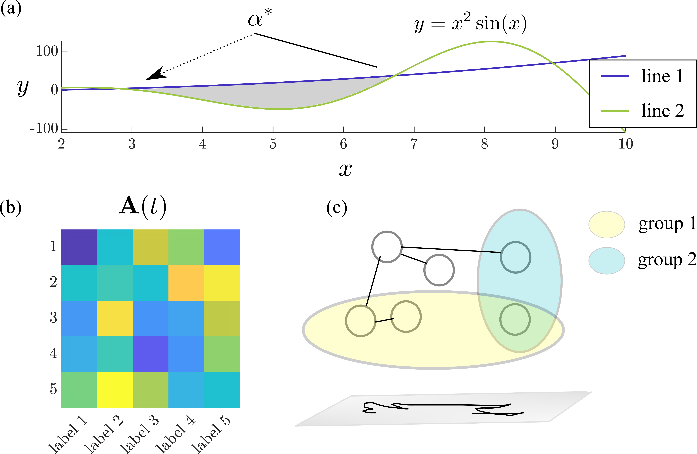

# Make Figures for Publication Tutorial
This repository contains tutorials for making figures for academic publications and presentations. The first tutorial covers generating subplots in [Matlab](https://www.mathworks.com/products/matlab.html) or [Python](https://www.python.org/) and then composing the subplots with annotations in [Inkscape](https://inkscape.org/).

An overview of figure preparation is contained in 

    demo make figures presentation.pptx

 

## [Tutorial 1 &ndash; basics](Tutorial_1_basics/)
The first tutorial details step-by-step instructions for creating this template figure using Matlab or Python and then Inkscape.

 

## [Tutorial 2 &ndash; colors (advanced)](Tutorial_2_colors_(advanced)/)

The second tutorial covers how to find and use professional color palettes in you figures instead of a Matlab colormap.

 

## [Tutorial 3 &ndash; presentation animations](Tutorial_3_presentation_animations/)
(in progress)
