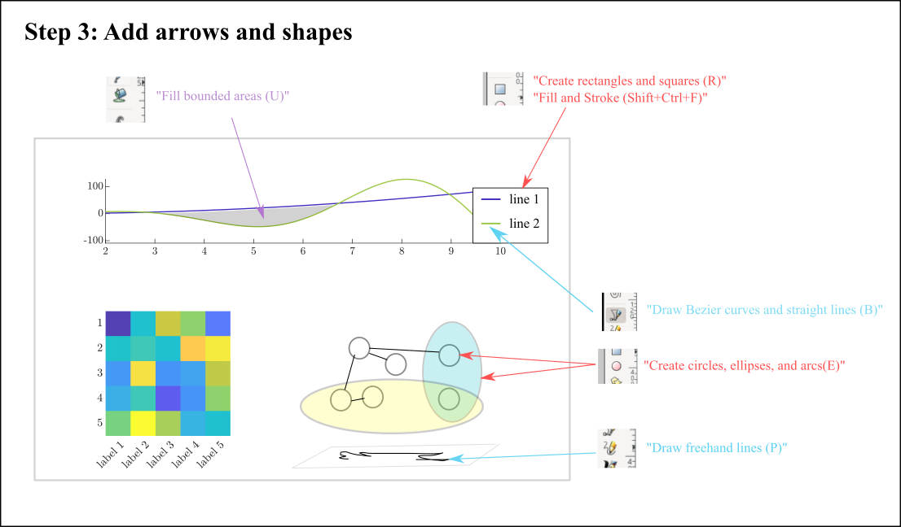

# Tutorial 1 &ndash; basics

This tutorial chronicles the step-by-step construction of the template figure seen below. We start by generating data and subfigures in Matlab (or Python) then compose subfigures and add annotations in [Inkscape](https://inkscape.org/) and end with a single pdf (or .eps, .png, other prefered format ...) of the entire panel (a, b, c) which can be easily inserted into a latex document. 

This tutorial covers the following...

1. How to standarize fonts and font sizes across figures and subfigures.

2. How to use colors from a Matlab color palette

3. How to compose a panel of individual figures in Inkscape.

4. How to add text and math latex annotations to a panel in Inkscape.

5. How to align and space all content in a panel.

6. How to save figure content as an appropriate file size.

This tutorial uses the following programs

1. [Matlab](https://www.mathworks.com/products/matlab.html) (or [Python](https://www.python.org/))

2. [Inkscape](https://inkscape.org/)

3. [Latex](https://www.latex-project.org/)

 

## Step 1 &ndash; Create subfigures in Matlab

Run the script

    demo_make_figs.m
  
which creates subfigures 

    demo_fig1.pdf
    demo_fig2.pdf
    
stored in the folder Tutorial 1 - basics/figures.

 

## Step 2 &ndash; Create figure panel in Inkscape

Inkscape tutorial is in the file
    
    demo_panel.svg
    
stored in the folder Tutorial 1 - basics/figures. This file must be opened using Inkscape and covers how to import .pdfs into Inkscape and create a figure panel.

 

### Open Inkscape

 

### Inkscape step 1 &ndash; import pdfs

 

### Inkscape step 2 &ndash; Make annotation layer

 

### Inkscape step 3 &ndash; Add arrows and shapes

 

### Inkscape step 4 &ndash; Change colors

 

### Inkscape step 5 &ndash; Align everything

 

### Inkscape step 6 &ndash; Create page around panel

