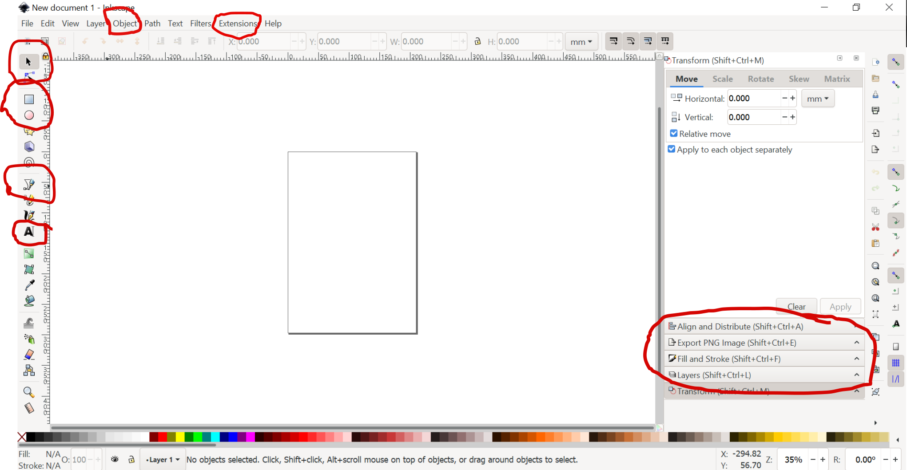
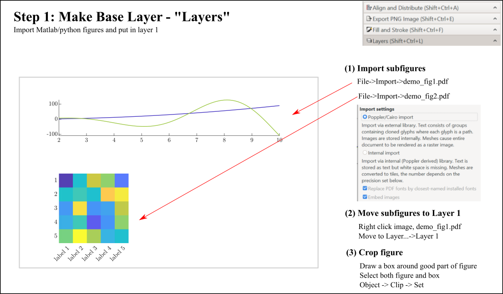
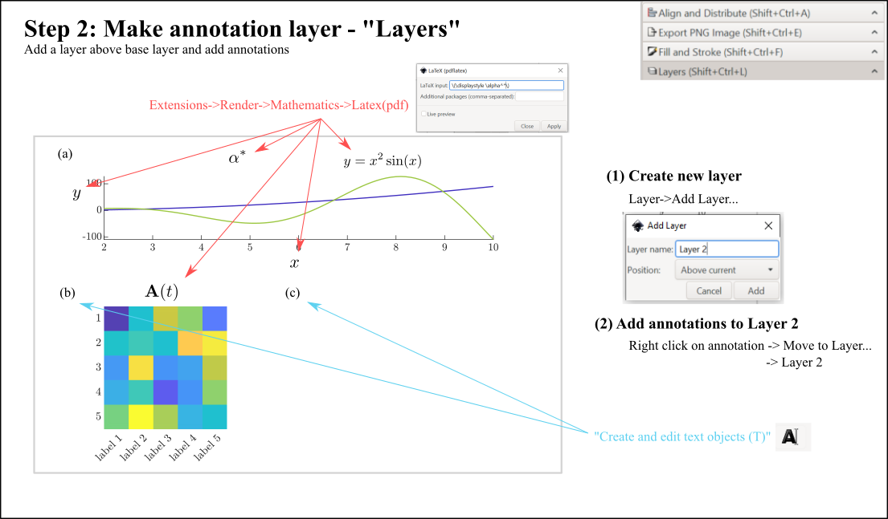
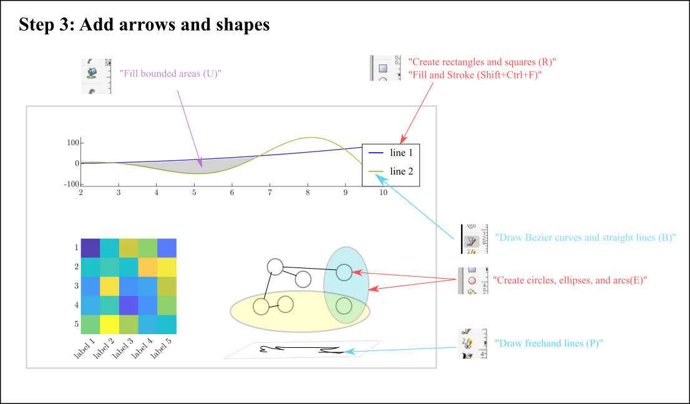
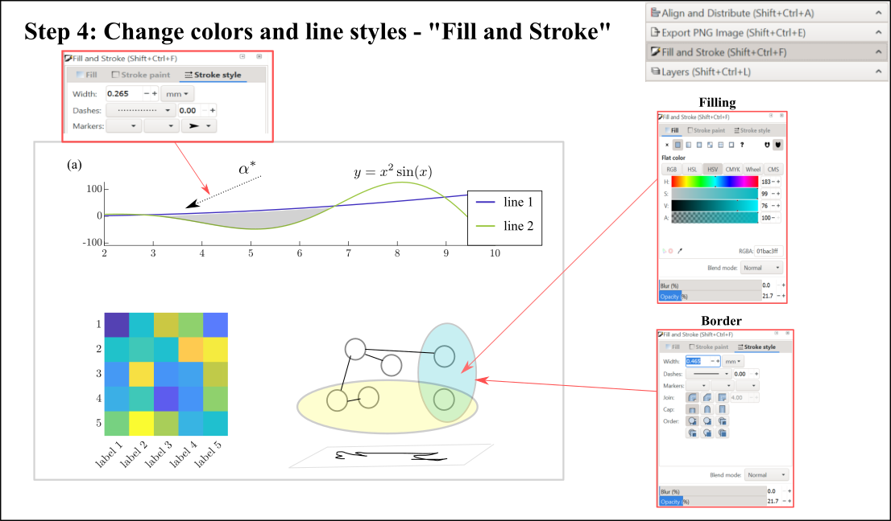
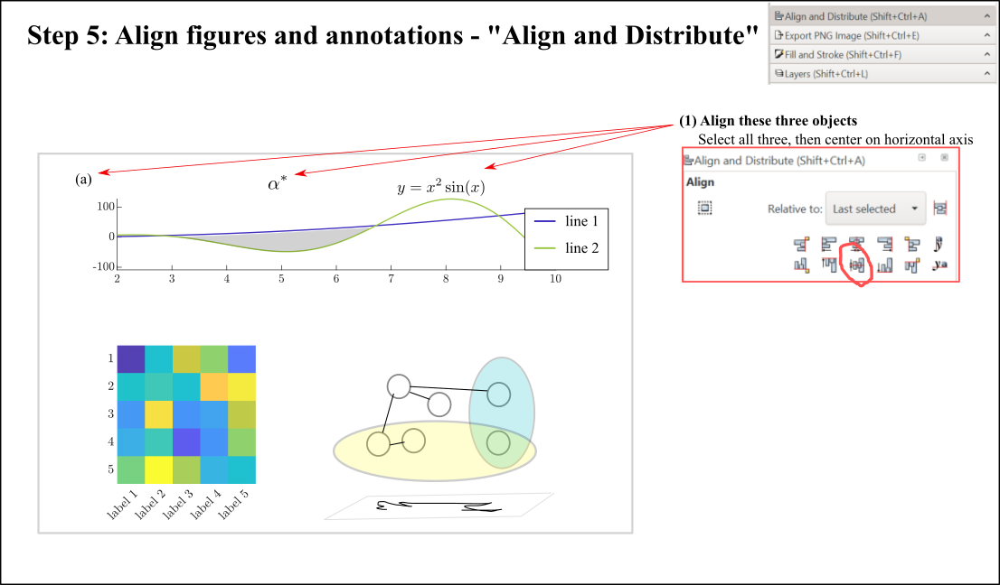
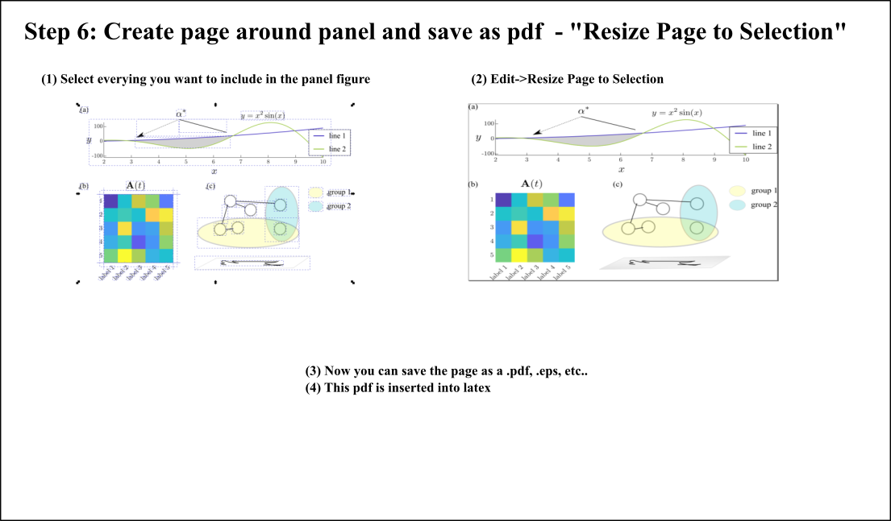
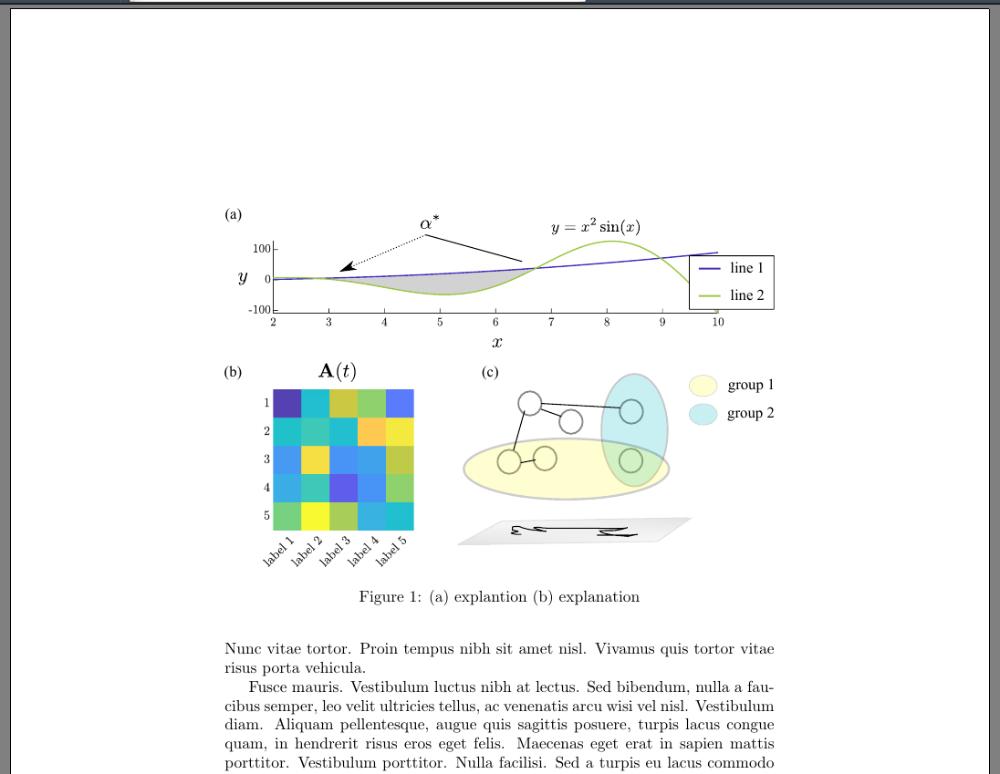

# Tutorial 1 &ndash; basics

This tutorial chronicles the step-by-step construction of the template figure seen below. We start by generating data and subfigures in Matlab or Python then compose subfigures and add annotations in [Inkscape](https://inkscape.org/) and end with a single pdf (or .eps, .png, other prefered format ...) of the entire panel (a, b, c) which can be easily inserted into a latex document. 

This tutorial covers the following...

1. How to standarize fonts and font sizes across figures and subfigures.

2. How to use colors from a Matlab or Python color palette

3. How to compose a panel of individual figures in Inkscape.

4. How to add text and math latex annotations to a panel in Inkscape.

5. How to align and space all content in a panel.

6. How to save figure content as an appropriate file size.

This tutorial uses the following programs

1. [Matlab](https://www.mathworks.com/products/matlab.html) or [Python](https://www.python.org/)

2. [Inkscape](https://inkscape.org/)

3. [Latex](https://www.latex-project.org/)

 

## Step 1 &ndash; Create subfigures in Matlab or Python

If using Matlab, run the script

    demo_make_figs.m
    
If using Python, run the script

    demo_make_figs.ipynb
  
These scripts generate the subfigures

    demo_fig1.pdf
    demo_fig2.pdf
    
stored in the folder [Tutorial_1_basics/figures](figures).

 

## Step 2 &ndash; Create figure panel in Inkscape

Inkscape tutorial is in the file
    
    demo_panel.svg
    
stored in the folder [Tutorial_1_basics/figures](figures). This file must be opened using Inkscape and covers how to import .pdfs into Inkscape and create a figure panel.

 

### Open Inkscape

Inkscape has many features. The most important tools on the right are "Align and Distribute", "Fill and Stroke", and "Layers". The most important tools on the left are "Select", "Create rectangles and squares", "Create circles, ellipses, and arcs", "Draw Bezier curves and straight lines", and "Create and edit text object". The most important tabs at the top are "Object" and "Extensions". We will cover what each of these tools are used for below.

 

### Inkscape step 1 &ndash; import pdf subfigures

**Import images:** First we import the pdf subfigures generated using Matlab or Python. Make sure the figures you are importing do not have too large of a file size. Working with large image files in Inkscape will make Inkscape very slow and even crash. If you have large image files, try making the files smaller before importing. One way to make files smaller is to plot few points when generating the figure in Matlab.

    File -> Import -> demo_fig1.pdf

**Add images to base layer:** We can add all images to the first layer and then create an additional layer above the base layer for which to add annotations.
    
    right click demo_fig1.pdf, Move to layer ->Layer 1
    
**Crop image:** If the pdf needs to be cropped we can do this by drawing a box around the part of the image that we want to keep, selecting both objects, and then clipping the set.

    Draw a box on top of image
    Select both box and image
    Object-> Clip -> Set

 

### Inkscape step 2 &ndash; Make annotation layer

All text and other annotations should be added to a layer above the base layer so that the annotations will always appear on top of the images.

**Create new layer:** First we must create a new layer by clicking on the layers tab and adding a layer above the current layer, naming it "Layer 2"
    
    Layer -> Add Layer
    
**Add annotations to new layer:** We can add anything we want to Layer 2 by right clicking on an object and changing the layer it is in

    Right click on annotation -> Move to Layer.. -> Layer 2
    

**Latex equation annotations:** We can add Latex equation objects by going to 

    Extensions -> Render -> Mathematics -> Latex(pdf)
    
This blog post [here](http://blog.jamiejquinn.com/rendering-latex-in-inkscape) covers adding latex equations in more detail. 

There are several other options for adding latex objects to Inkscape. 

[TexText - Re-editable LaTeX graphics for Inkscape](https://textext.github.io/textext/index.html) is a Python extension for Inkscape that allows you to add and re-edit LaTeX generated SVG elements to your drawing. 

[LaTeXText: Render LaTeX in Inkscape](https://inkscape.org/~seebk/%E2%98%85latextext-render-latex-in-inkscape) is a different Inkscape extesion that searches all text elements in a document and renders them with PdfLatex.

 

### Inkscape step 3 &ndash; Add arrows and shapes

Next we want to add arrow and shapes and move them all to "Layer 2".

**Create horizontal or vertial line:** Hold down the "Ctrl" key as you draw your straight line, this will force it to be horizontal or vertical.

 

### Inkscape step 4 &ndash; Change colors and line styles

We can edit any of the objects we have just created by selecting the object and then clicking on the "Fill and Stroke" tab.

**Line thickness:** 
    
    Fill and Stroke -> Stroke style -> Width

**Make dashed lines:**
    
    Fill and Stroke -> Stroke style -> Dashes

**Add arrow to end of line:** 
    
    Fill and Stroke -> Stroke style -> Markers
    
**Change transparency:** 

    Fill and Stroke -> Opacity (%)

**Blur:**
    
    Fill and Stroke -> Blur (%)
    
**Change color:**
 
    Fill and Stroke -> Stroke paint -> "pick colors from image"

**Change box fill and color:**
    
    Fill and Stroke -> Fill

 

### Inkscape step 5 &ndash; Align everything

Next we can align all the objects that should be aligned horizontally and vertically. Select two or more objects that you want aligned and then select

    Align and Distribute -> Align -> "Center on horizontal axis"
    
Objects will be aligned relative to the last object selected. You can change what the alignment is relative to by going to 
    
    Align and Distribute -> Align -> Relative to: -> "First selected"
    

 

### Inkscape step 6 &ndash; Create page around panel

**Draw page around final figure:** Lastly, we want to make the Inkscape page fit exacty around the panel we have just created. We can do this by selecting all the objects you wish to include in the final figure and then clicking

    Edit -> Resize Page to Selection
    
The Inkscape page will now exactly encapsulate your final figure. Whatever is in the Inkscape page is what gets saved in the pdf.

**Save final figure:** Save the page as a pdf by going to 

    File -> Save As -> demo_panel.pdf
    
save the type as either a .pdf or a .eps.
    

This final figure "demo_panel.pdf" can now be inserted into a latex document.

 

## Step 3 &ndash; Place final figure into Latex document

All that is left now is to call on the figure within the Latex document.  Open the .tex file

    demo_paper.tex
    
  Include the following package in the Latex document preamble
  
    \usepackage{graphicx}
    
Insert the figure into the tex document with the commands

    \begin{figure}[t]
        \centering
        \includegraphics[width=1.0\linewidth]{figures/demo_panel.pdf}
        \caption{(a) explantion (b) explanation}
        \label{fig:demo_panel}
    \end{figure}
    

